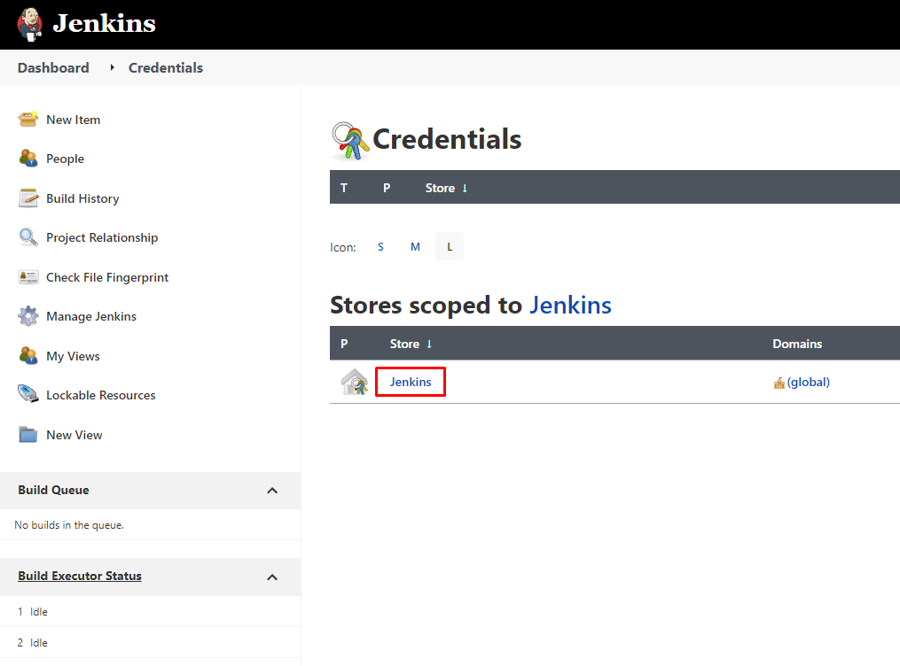
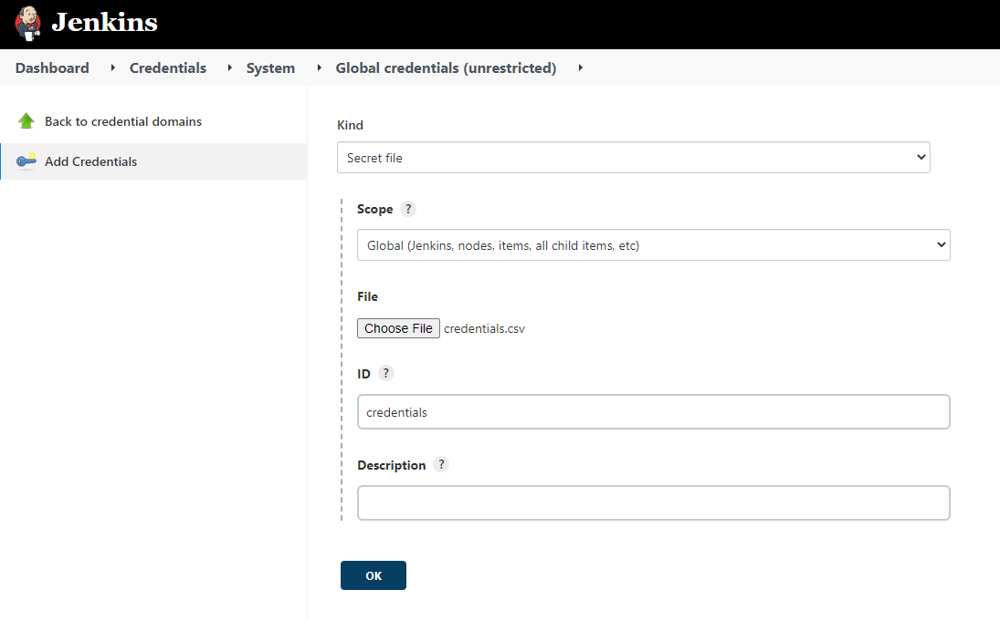

# JenkinsSeleniumJava Project

## Required tools

* Docker
* docker-compose

## Run it

1. Download Jenkins data from [here](https://drive.google.com/file/d/19dv1ikDC9csGwltyceBUPSqjfMnXqsiw/view?usp=sharing).
2. Extract the downloaded archive file to the repository root folder.
3. Run `docker-compose up`.
4. You will need to turn off two-factor authentication in your Amazon account temporarily. Unfortunately, the tests do not support 2FA at the moment :)
5. Create a `credentials.csv` file in the root repository folder with these contents:
   ```csv
   username,password
   your@amazon.email,your_amazon_password
   ```
6. Upload your `credentials.csv` file to Jenkins:
   1. Open `http://localhost:8080/` in your browser.
   2. Login to Jenkins with username `admin` and password `admin`.
   3. Click "Manage Jenkins".
   4. Click "Manage Credentials".
   5. Click the "Jenkins" credentials store:
      
      
   6. Click the "Global credentials (unrestricted)" domain.
   7. Click "Add Credentials".
   8. Select "Kind" option "Secret File".
   9. Ignore the "Scope".
   10. Choose the file `credentials.csv` that you created previously.
   11. Fill in the ID column with value `credentials`. *It is important to enter the correct value.*
   12. Click "OK".
      
      
7. Go back to the main Jenkins page.
8. Run the "Tests" build.

## Observe it

If you would like to watch test execution, you can go to `http://localhost:7900/` with password `secret`.

## Tear it down

Run `docker-compose down` to clean everything up.
